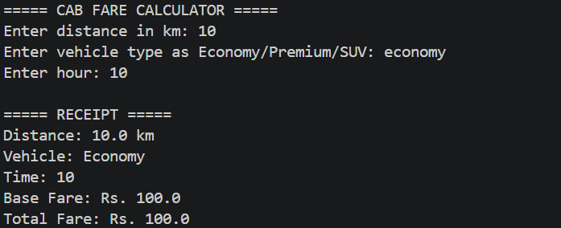
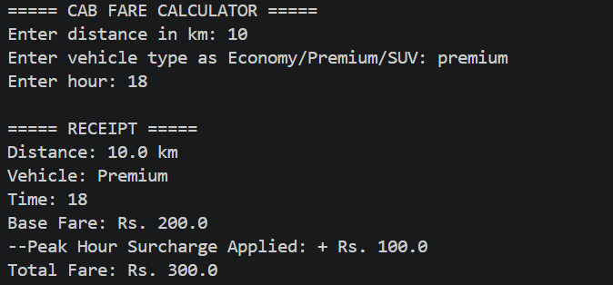
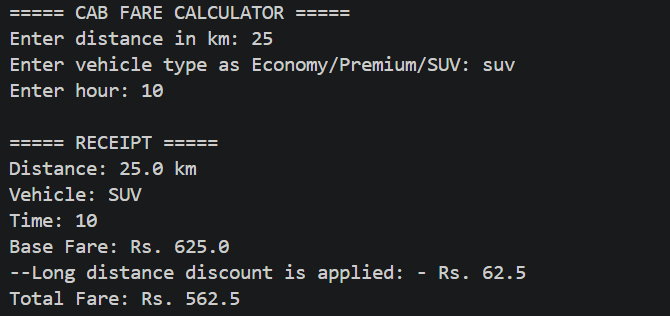

# 🚖 FareCalc – Travel Optimizer (Python)

This project is a simple Python-based fare calculation system developed for a ride-sharing startup scenario. It calculates the ride cost based on distance, vehicle type, and time of the day.

The system also includes real-world logic such as surge pricing during peak hours, minimum fare constraints, and long-distance discounts.

---

## 🚀 Project Overview

The FareCalc system allows users to:

- Enter distance (in km)
- Select vehicle type (Economy / Premium / SUV)
- Enter time (hour of the day)

Based on these inputs, the system calculates the final fare and displays a formatted receipt.

---

## 🛠️ Features

- 📊 Vehicle-based pricing using dictionary mapping  
- ⏰ Surge pricing (1.5x) during peak hours (5 PM – 8 PM)  
- 🧾 Formatted fare receipt  
- ⚠️ Input validation (distance, hour, vehicle type)  
- 🔁 Case-insensitive vehicle input handling  
- 💰 Minimum fare enforcement (₹50)  
- 🎯 Long-distance discount for trips above 20 km  

---

## 📁 Project Structure

---

## ▶️ How to Run

1. Open terminal / command prompt  
2. Navigate to project folder cd "FareCalc Travel Optimizer" 
3. Run the program  

---

## 📸 Screenshots

### 🔹 Normal Case

### 🔹 Peak Hour Surge

### 🔹 Invalid Input

### 🔹 Long Distance Discount

---

## 🧠 Concepts Used

- Python Dictionaries  
- Functions  
- Conditional Statements  
- Exception Handling  
- User Input Handling  

---

## 🎯 Key Learnings

- Implementing real-world business logic in Python  
- Handling edge cases and invalid inputs  
- Writing clean and structured code  
- Improving user experience with validations  

---

## 👨‍💻 Author

**Akhilanandateja Sanga**

